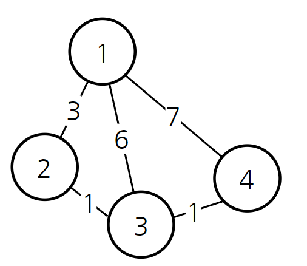
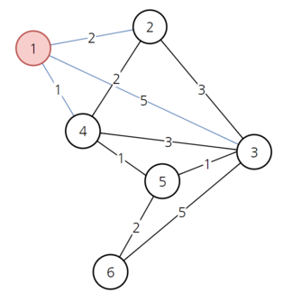

# 최단 경로 [다익스트라]
## 📌 다익스트라(Dijkstra)
다익스트라 알고리즘은 다이나믹 프로그래밍을 활용한 대표적인 최단 경로(Shortest Path) 탐색 알고리즘입니다.
흔히 인공위성 GPS 소프트웨어 등에서 가장 많이 사용됩니다.

- 다익스트라 알고리즘은 특정한 하나의 정점에서 다른 모든 정점으로 가는 최단 경로를 알려줍니다.
- 다익스트라 알고리즘이 다이나믹 프로그래밍 문제인 이유는 **최단 거리는 여러 개의 최단 거리로 이루어져 있기 때문입니다.**
- 기본적으로 다익스트라는 하나의 최단 거리를 구할 때 이전까지 구했던 최단 거리 정보를 그대로 사용한다는 특징이 있습니다.


## 📌 그림 설명
한 번 다음 경우를 고려해봅시다. 1부터 다른 모든 노드로 가는 최단 경로를 구해야 합니다.


예를 들어 1에서 3까지 가는 최소 비용은 6입니다. 경로 1-> 3의 비용이 6인 데에 반해 경로 1->2->3이 총 비용4로 더 저렴하다는 것을 컴퓨터는 알게 됩니다. 이때 현재까지 알고 있던 3으로 가는 최소 비용6을 4로 갱신합니다.

다시 말해 다익스트라 알고리즘은 **현재까지 알고 있던 최단 경로를 계속해서 갱신**합니다.

### 구체적인 작동 과정은 다음과 같습니다.
1. 출발 노드를 설정합니다. 
2. 출발 노드를 기준으로 각 노드의 최소 비용을 저장합니다.
3. 방문하지 않은 노드 중에서 가장 비용이 적은 노드를 선택합니다. (최소 힙을 사용할 수 있다.)
4. 해당 노드를 거쳐서 특정한 노드로 가는 경우를 고려하여 최소 비용을 갱신합니다.
5. 위 과정에서 3~4번을 반복합니다.

위의 과정대로 예시 문제를 풀어보겠습니다.



1. 1번 노드를 시작점으로 가정하고 1번노드와 연결된 세 개의 간선을 확인한 상태를 1차원 배열로 만들어 나타낼 수 있다. 
2. 1번 노드에서 알 수 없는 노드는 무한으로 표시한다.


3. 1번노드에서 연결된 노드중 최소 비용을 가진 노드4번부터 방문합니다.
4. 노드4번에서 갈 수 있는 노드까지의 비용을 계산해서 기존 배열에 저장된 비용보다 작다면 값을 갱신합니다.
5. 5로가는 최소 비용은 무한이었지만 노드4를 거쳐서 5로 가는 경우는 비용이 2이므로 갱신되었다.


6. 그다음 방문하지 않은 노드 중 최소 비용을 가진 노드2을 방문해서 같은 과정을 반복한다. 
7. 하지만 노드2를 거쳐 가더라도 기존 비용보다 작은 값이 없기 때문에 갱신되지 않고 유지됩니다.


8. 그다음 최소 비용을 가진 노드5를 방문합니다.
9. 노드 5를 거쳐 6으로 가능 경로의 비용이 기존 비용보다 작기 때문에 4로 갱신됩니다.


10. 그다음 최소 비용을 가진 노드3를 방문합니다.  
11. 최소 비용이 되는 경로가 없기 때문에 아무 일도 일어나지 않습니다.

12. 마지막으로 방문되지 않은 노드6번을 방문하고 최종 배열이 다음과 같이 완성됩니다.


## 📌 다익스트라 코드
- 다익스트라 직접 구현

```python
import sys
from collections import defaultdict

# 입력값 파일
sys.stdin = open( "input.txt", 'r')

n, m = map(int, input().split())
start = int(input())

# 노드,간선 데이터 graph에 딕셔너리 형식으로 저장
graph = defaultdict(list)
for i in range(n+1):
    graph[i] = []

for _ in range(m):
    a, b, c = map(int, input().split())
    graph[a].append((b, c))

# 무한 값 
INF = int(1e9)

# 다익스트라 구현
def dijkstra_naive(graph, start):
    def get_smallest_node():
        min_value = INF
        idx = 0
        for i in range(1, N):
            if dist[i] < min_value and not visited[i]:
                min_value = dist[i]
                idx = i
        return idx

    N = len(graph)
    visited = [False] * N
    dist = [INF] * N

    visited[start] = True
    dist[start] = 0

    for adj, d in graph[start]:
        dist[adj] = d

    # N개의 노드 중 첫 노드는 이미 방문했으므로,
    # N-1번 수행하면 된다.
    for _ in range(N - 1):
        # 가장 가깝고 방문 안한 녀석을 고르고,
        cur = get_smallest_node()
        visited[cur] = True

        # 최단거리를 비교, 수정한다.
        for adj, d in graph[cur]:
            cost = dist[cur] + d
            if cost < dist[adj]:
                dist[adj] = cost
    return dist
dijkstra_naive(graph, start)
```
___
파이썬 최소 힙을 이용한 다익스트라 코드
- 탐색할 노드를 고를 때 비용이 최소 값인 노드를 선택해야 한다. 그래서 최소 힙 모듈을 사용해서 구현할 수 있다.

```python
import sys
import heapq
from collections import defaultdict

# 입력값 파일
sys.stdin = open( "input.txt", 'r')

n, m = map(int, input().split())
start = int(input())

# 노드,간선 데이터 graph에 딕셔너리 형식으로 저장
graph = defaultdict(list)
for i in range(n+1):
    graph[i] = []

for _ in range(m):
    a, b, c = map(int, input().split())
    graph[a].append((b, c))

# 무한 값 
INF = int(1e9)

# 다익스트라 힙사용
def dijkstra_pq(graph, start):
    N = len(graph)
    dist = [INF] * N

    q = []
    # 튜플일 경우 0번째 요소 기준으로 최소 힙 구조.
    # 첫 번째 방문 누적 비용은 0이다.
    heapq.heappush(q, (0, start))
    dist[start] = 0

    while q:
        # 누적 비용이 가장 작은 녀석을 꺼낸다.
        acc, cur = heapq.heappop(q)

        # 이미 답이 될 가망이 없다.
        if dist[cur] < acc:
            continue

        # 인접 노드를 차례대로 살펴보며 거리를 업데이트한다.
        for adj, d in graph[cur]:
            cost = acc + d
            print(dist)
            if cost < dist[adj]:
                dist[adj] = cost
                heapq.heappush(q, (cost, adj))

    return dist

dijkstra_pq(graph, start)
```