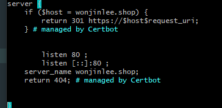
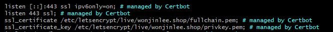

# Nginx와 Certbot(Let's Encrypt)으로 HTTPS 설정하기

## 📌 Nginx의 Reverse Proxy
Reverse Proxy: 외부에서 내부 서버가 제공하는 서비스 접근 시, Proxy 서버를 먼저 거쳐서 내부 서버로 리다이렉션하는 기능

certbot으로 Let's Encrypt의 인증서를 발급받고 nginx에서 https 설정을 하고 Nginx의 Reverse Proxy를 이용해서 HTTPS(443)요청과 80포트 요청이 들어오면 node 서버로 리다이렉션한다.
___

## Nginx와 certbot 설치, 인증서 발급
1. nginx를 설치한다.
```shell
sudo apt-get install -y nginx
```

2. Certbot 설치
- [Certbot 설치](https://certbot.eff.org/instructions) : 여기서 웹 서버과 시스템을 선택하면 그 환경에 맞는 설치 방법을 자세히 알려준다.

- Shell 명령어인 certbot-auto 를 활용한 방법은 더 이상 지원하지 않고 있으며, 삭제를 권하고 있다.
- 참고로 HTTPS는 도메인을 통해서 적용시키므로 IP로만 접속할 수 있다면 해당 **IP에 도메인을 연결해야한다**.

```shell
sudo snap install core
sudo snap refresh core
sudo snap install --classic certbot

sudo ln -s /snap/bin/certbot /usr/bin/certbot
sudo certbot --nginx
```
sudo certbot --nginx 를 입력하면 다음과 같은 질문들이 나온다.

1. 디버깅을 위한 로그, 긴급한 사항 혹은 보안 사항, Lets Encrypt인증서 기간이 3개월이기 때문에 남은 기간에 대한 소식 등을 전달할 이메일을 입력해달라는 내용, 연락받을 이메일을 입력한 후 엔터
2. 약관을 읽고 SSL 을 사용하기 위한 서버 등록을 승낙해야 한다는 이야기. Y 입력한 후 엔터
3. 위에서 입력했던 이메일을 재단에도 공유해서 재단의 뉴스, 캠페인, 디지털 자유운동 지원 방법 등을 받을 것인지에 대한 내용, Y 입력한 후 엔터.
4. 어떤 도메인에 HTTPS를 적용시킬지 물어본다. 그냥 엔터를 누르면 목록에 뜬 모든 도메인에 HTTPS를 적용시켜주고, `1 2` 이런식으로 숫자를 띄어서 엔터를 누르면 해당 도메인만 HTTPS를 적용시켜 준다. 도메인 떠있지 않다면 서버ip에 연결된 도메인 주소 하나를 입력한다.

이 방법을 따라왔다면 기본 옵션을 수정하지 않는 한, certbot 은 만료 전에 자동으로 갱신되며 리다이렉트까지 자동으로 설정되어 있다.

```shell
#  SSL 자동 갱신
# Let's Encrypt인증서는 90일 동안만 유효하다.
# 따라서 자동으로 갱신하도록 한다.
sudo certbot renew --dry-run

# 웹서버를 재시작을 해주고 해당 도메인을 들어가면 https로 연결되는 것을 알 수 있다.
sudo service nginx restart
```

___
## HTTP를 HTTPS로 리다이렉션, HTTPS(443)에서 NodeJS 서버로 보내도록 설정하기
```shell
# Nginx SSL 인증서 관련 설정
sudo vi /etc/nginx/sites-available/default
``` 
위 명령어로 nginx 옵션에 들어가서 리다이렉션될 주소와 Cors등을 설정해 줄 수 있다.
기본적으로 위 인증서를 발급 받으면서 자동적으로 설정이 되었있을 것이다.



default 에서 가장 밑에 있을 해당 server 블록에서, 80포트로 들어오는 요청을 HTTPS 도메인으로 리다이렉션 되도록 설정할 수 있다. 



그 바로 위에는 443포트로 들어오는 server 부분을 설정할 수 있다. 이 부분을 잘 살펴보면 certbot으로 발급 받은 인증서를 찾아 볼 수 있다.

```shell
location / { 
    cors 설정 ... 
    
    proxy_set_header HOST $host
    proxy_pass http://"서버ip":"port";
    proxy_redirect off;
} 
```
여기에서 proxy_pass에 내서버 ip주소를 입력하면 nginx와 내 서버로 Reverse Proxy 설정이 된다.
___
## 📌설정하면서 발생했던 에러
### 1. certbot에서 도메인을 입력 후 80에 관한 Error 
certbot에서 도메인을 입력 후 80에 관한 Error가 발생한다면 nginx가 아닌 다른 곳에서 이미 80 포트를 사용중이기 때문에 발생할 수 있는 에러이다.
 ```
 # 80포트를 사용중인 서버를 알 수 있다.
 sudo lsof -i tcp:80 (nginx가 보여야 함)
 
 # 80 사용중이 서버를 kill하고 아래 명령어로 nginx 실행한다.
 sudo systemctl start nginx (정상 실행이면 바로 아무 말 없이 실행)
 ```
이렇게하면 도메인 설정할 때 정상적으로 동작된다.

### 2. Nginx Cors 설정
개발중인 node 서버에서 socket을 사용하는데 브라우저에서 cors Error메세지가 발생했다. 
이미 node 서버에서는 cors 설정을 모두 마친 상태였고 에러도 발생하지 않았는데 nginx를 사용함과 동시에 발생되었다. 
**Nginx를 사용했다면 Nginx 또한 Cors를 설정해주어야 한다.**

```shell
server {
       # ... 생략

        location / {
                # CORS 설정                
                proxy_hide_header Access-Control-Allow-Origin;
                add_header 'Access-Control-Allow-Origin' '$http_origin' always;

                # nginx 와 socket.io 연동
                #socket.io 사용시 아래설정 필수!!             
                proxy_http_version 1.1;
                proxy_set_header Upgrade $http_upgrade;
                proxy_set_header Connection "Upgrade";
                
                # Reverse Proxy 설정                
                proxy_set_header HOST $host;
                proxy_pass http://"서버ip":"port";
                proxy_redirect off;
        }
           # ... 생략
}
```
Nginx 구조와 Cors 설정하는 방법에 대해서는 더 공부를 해봐야겠다. 